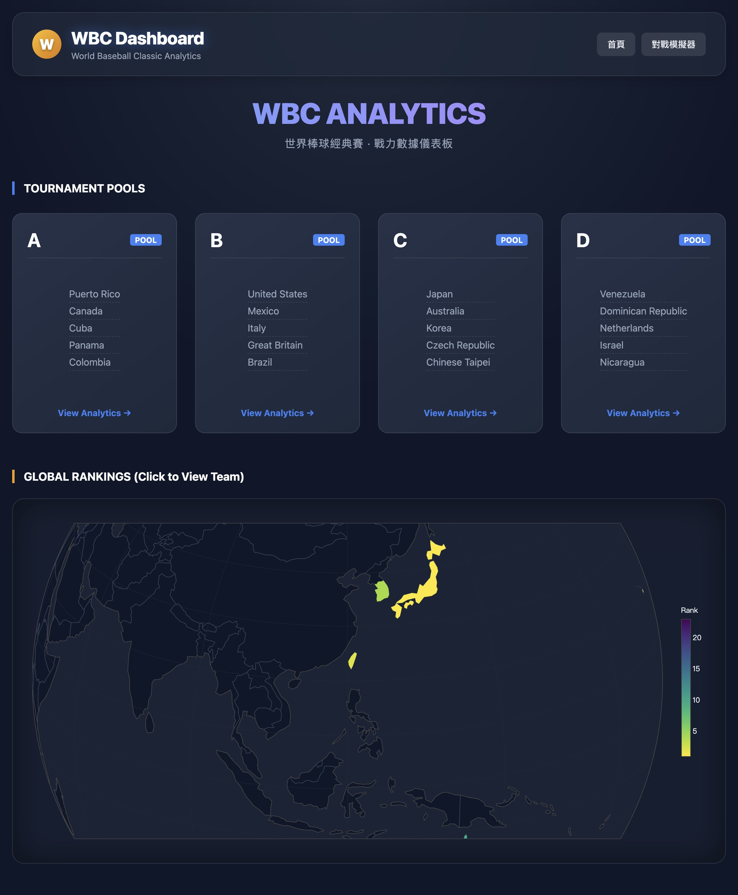
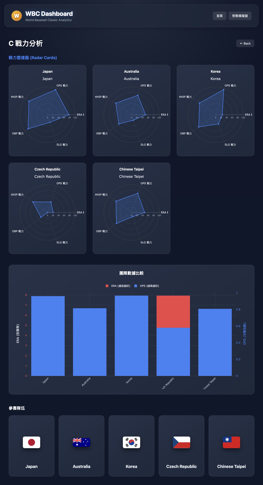
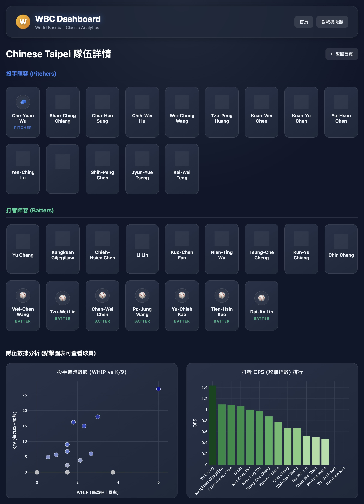
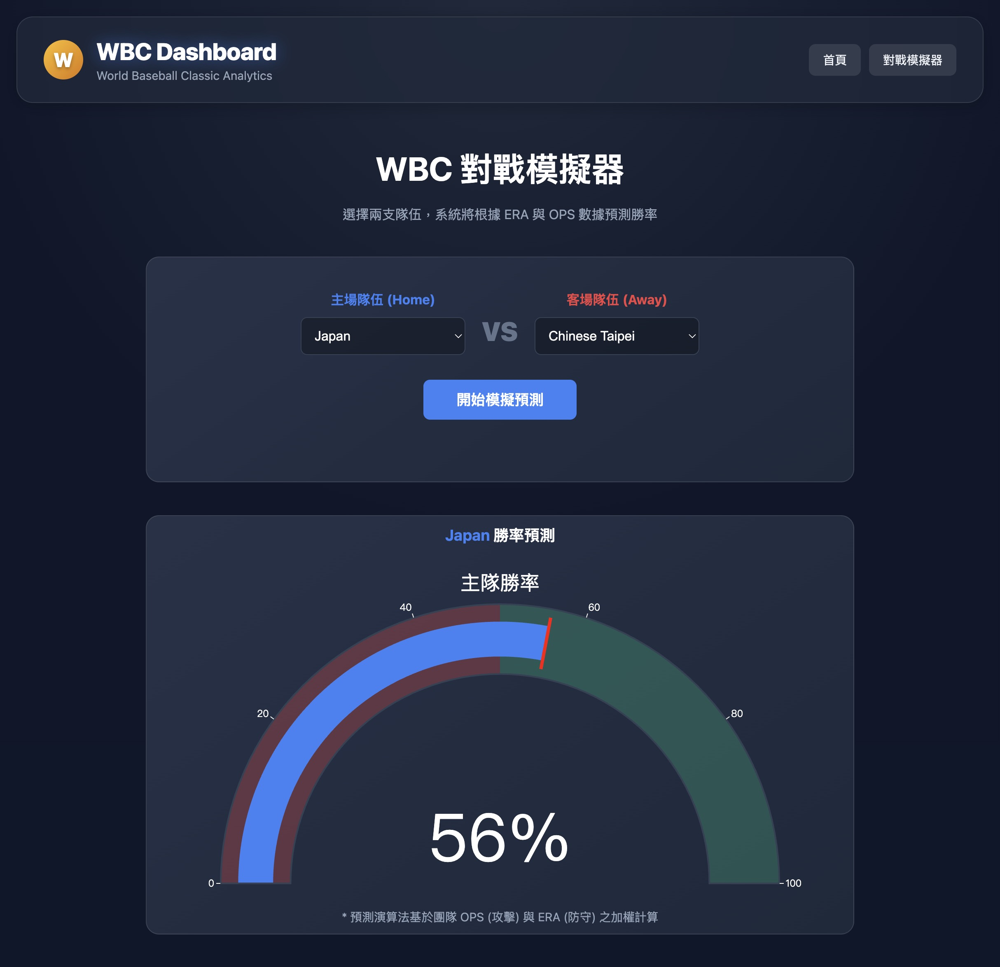

# ⚾ WBC Analytics Dashboard (世界棒球經典賽戰力分析儀表板)

[](https://www.python.org/)
[](https://flask.palletsprojects.com/)
[](https://plotly.com/javascript/)
[](https://nginx.org/)
[](https://wbcwebsite.20031023.xyz)

> **資料視覺化課程期末專題**：一個基於 Python Flask 與 Plotly.js 建構的互動式資料視覺化平台，提供 WBC 經典賽的球隊數據分析、下鑽式 (Drill-down) 探索體驗以及勝率對戰模擬。

**🌐 線上演示 (Live Demo):** [https://wbcwebsite.20031023.xyz](https://wbcwebsite.20031023.xyz)


## 📸 專案預覽 (Screenshots)

| **首頁** | **分組戰力分析** |
|:---:|:---:|
|  |  |

| **隊伍詳情** | **對戰模擬器** |
|:---:|:---:|
|  |  |


## 🗺️ 專案設計藍圖 (Project Blueprint)

本專案的核心設計理念為「層層下鑽 (Drill-Down)」的資料流體驗，引導使用者從宏觀視角逐步深入至微觀數據。

### Level 1: 總覽頁面 (World View)
* **功能**: 提供全域視野，展示所有參賽國家的地理分佈與分組概況。
* **視覺化技術**:
    * **3D Choropleth Globe**: 使用 Plotly 的 Orthographic 投影，依據「WBSC 世界排名」進行熱力圖上色。
    * **互動卡片**: 直式分組卡片，快速預覽各組參賽隊伍。
* **下鑽路徑**: 點擊地圖國家或分組卡片 $\rightarrow$ 進入 Level 2 分組頁面。

### Level 2: 分組頁面 (Pool Analysis)
* **功能**: 針對特定分組 (如 Pool A) 內的 5 支隊伍進行交叉比對。
* **視覺化技術**:
    * **Radar Chart (雷達圖)**: 比較各隊在「打擊」、「防守」、「速度」、「長打」、「投手」五個維度的綜合戰力。
    * **Dual-Axis Bar Chart (雙軸長條圖)**: 同時呈現 **Team ERA** (防禦率，越低越好) 與 **Team OPS** (攻擊指數，越高越好) 的反向指標比較。
* **下鑽路徑**: 點擊雷達圖或長條圖 $\rightarrow$ 進入 Level 3 國家隊頁面。

### Level 3: 國家隊頁面 (Team Detail)
* **功能**: 展示單一隊伍的球員名單與詳細攻守數據分佈。
* **視覺化技術**:
    * **Mini Trading Cards**: 模擬球員卡的直式 UI 設計，區分投手 (藍色) 與打者 (綠色)。
    * **Scatter Plot (散點圖)**: 投手進階數據分析 (X軸: WHIP, Y軸: K/9)，識別三振型 vs 控球型投手。
    * **Bar Chart (長條圖)**: 打者 OPS 排行。
* **下鑽路徑**: 點擊球員卡或圖表上的點 $\rightarrow$ 進入 Level 4 球員個人頁面。

### Level 4: 球員頁面 (Player Stats)
* **功能**: 個人生涯數據與詳細投打表現。
* **視覺化技術**:
    * **Pie Chart (圓餅圖)**: 打席結果分佈 (安打/全壘打/出局) 或 投手三振保送比。
    * **Detail Stats**: 針對該球員的詳細數據卡片。


## 🔮 對戰模擬器 (Matchup Simulator)

除了數據呈現，本專案實作了一個後端預測模型，讓使用者自選兩隊進行模擬。

* **前端互動**: 選擇「主場隊伍」與「客場隊伍」。
* **後端邏輯**:
    * 接收 API POST 請求 `/api/predict`。
    * **加權公式**: `Score = (Team_OPS * 1000) - (Team_ERA * 50)` (攻擊力最大化，防禦率最小化)。
    * 計算雙方勝率百分比 (Win Probability)。
* **結果呈現**: 使用 Plotly **Gauge Chart (儀表板圖)** 動態顯示預測勝率。


## 🛠️ 技術架構 (Tech Stack)

### Backend (後端)
* **Python Flask**: 處理路由、API 邏輯與資料傳遞。
* **JSON/CSV**: 本地資料庫與外部 GitHub 數據源整合。

### Frontend (前端)
* **HTML5 / Jinja2**: 模板引擎。
* **CSS3 (Custom Style)**:
    * 手刻 **Glassmorphism (玻璃擬態)** 深色主題。
    * 實作 **3D Tilt Effect** (JS+CSS)，讓卡片隨滑鼠移動產生光澤與傾斜視差。
    * RWD 響應式佈局 (Grid/Flexbox)。
* **JavaScript (ES6+)**:
    * **Plotly.js**: 核心圖表繪製 (3D 地球儀、雷達圖、互動圖表)。
    * **D3.js**: 異步載入外部 CSV 數據。

### Infrastructure (部署架構)
本專案部署於 Linux 實體伺服器，採用業界標準生產環境架構：
* **DNS/CDN**: Cloudflare (SSL/TLS Encryption)。
* **Web Server**: Nginx (Reverse Proxy, Static Files)。
* **App Server**: Gunicorn (WSGI)。
* **Process Manager**: Systemd (Auto-restart)。


## 🚀 如何在本地執行 (Installation)

1.  **Clone 專案**
    ```bash
    git clone https://github.com/rayhuang2006/WBC_Website.git
    cd WBC_Website
    ```

2.  **建立並啟動虛擬環境**
    ```bash
    python3 -m venv venv
    source venv/bin/activate  # macOS/Linux
    # venv\Scripts\activate   # Windows
    ```

3.  **安裝依賴**
    ```bash
    pip install -r requirements.txt
    ```

4.  **啟動開發伺服器**
    ```bash
    python app.py
    ```
    打開瀏覽器訪問 `http://127.0.0.1:5001`


## 📊 資料來源 (Data Sources)

* **WBC 官方數據**: 參賽隊伍與球員基礎名單。
* **WBSC 世界排名**: 用於地圖權重視覺化。
* **GitHub Open Data**: 引用自 `slps101023/Datasets` 提供的詳細投打 CSV 數據。
